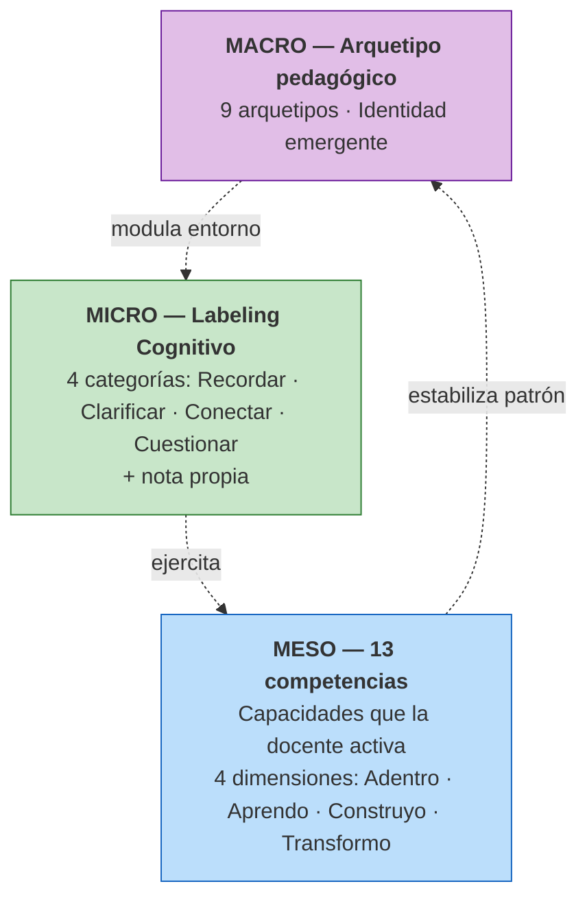

# Marco conceptual de Criter Academy

!!! info "Sobre este documento"
    Este es el marco conceptual completo del producto Criter Academy: arquetipos pedagógicos, las 13 competencias, Labeling Cognitivo y la articulación de tres niveles macro-meso-micro. Documento interno v2 · Mayo 2026.

    **Relación con el estudio ANII:** el proyecto ANII observa la operación **micro** (Labeling Cognitivo) como evidencia granular de proceso. La arquitectura completa de tres niveles informa el diseño pero no es objeto de validación directa en el proyecto. La validación ecológica longitudinal del modelo completo es la apuesta metodológica mayor de Criter, de la cual el estudio ANII constituye el primer caso situado.

## Resumen ejecutivo

Criter Academy se construye alrededor del notebook como artefacto central de intervención pedagógica. Su marco conceptual articula tres niveles ontológicos:

La articulación es **bidireccional**: en sentido ascendente, los actos micro de Labeling ejercitan competencias meso, que al acumularse producen el patrón estable del arquetipo macro. En sentido descendente, el arquetipo identificado modula la personalización del entorno donde ocurre la próxima operación micro.

## Los nueve arquetipos pedagógicos

| Arquetipo | Núcleo pedagógico | Anclaje principal |
|-----------|-------------------|-------------------|
| **Tejedor** | Vínculo, comunidad, pertenencia | Noddings — Ethics of Care |
| **Explorador** | Curiosidad, asombro, expedición | Schwab — Inquiry-Based Learning |
| **Arquitecto** | Diseño con intención, andamio | Wiggins & McTighe — Understanding by Design |
| **Catalizador** | Silencio activo, facilitación | Rowe — Wait Time research |
| **Narrador** | Storytelling, resonancia emocional | Bruner — Narrative Mode of Thought |
| **Alquimista** | Transmutación pedagógica, innovación | Csikszentmihalyi — Creativity research |
| **Guía** | Visión larga, autonomía real | Knowles — Self-Directed Learning |
| **Maker** | Manos que piensan, prototipado | Papert — Constructionism |
| **Sanador** | Bienestar como condición del aprendizaje | Noddings — Ethics of Care; CASEL |

→ Cada arquetipo tiene anclaje específico en literatura consolidada. Detalle completo abajo.

## Las trece competencias

Las competencias del modelo Criter describen **capacidades que la docente activa en sus estudiantes**, no capacidades que la docente posee sobre el contenido. Esta inversión es deliberada: el aprendizaje se mide en el efecto producido sobre quien aprende.

Organizadas en cuatro dimensiones:

| Dimensión | Foco | Competencias |
|-----------|------|--------------|
| **ADENTRO** | Identidad, autoconciencia | A1 Bienestar · A2 Autoconfianza · A3 Curiosidad · A4 Resiliencia |
| **APRENDO** | Aprendizaje continuo | B1 Autonomía · B2 Criterio · B3 Adaptabilidad tecnológica |
| **CONSTRUYO** | Diseño de experiencias | C1 Vínculos · C2 Colaboración · C3 Diálogo |
| **TRANSFORMO** | Impacto y agencia | D1 Propósito · D2 Agencia · D3 Legado |

## Labeling Cognitivo

Operación cotidiana de marcado del contenido en cuatro categorías mutuamente excluyentes:

- **Recordar** — selección de contenido significativo para retener (Adler, 1940; Marshall, 1997)
- **Clarificar** — reconocimiento de brecha de comprensión (Palincsar y Brown, 1984)
- **Conectar** — generatividad con conocimiento previo (Hattan et al., 2024; Ausubel, 1968)
- **Cuestionar** — disenso productivo (Engle y Conant, 2002; Adler, 1940)

Cada marca se complementa con una **nota propia** de la docente que explica el marcado, en texto o voz transcrita. La nota convierte la etiqueta —señal pobre— en etiqueta más lenguaje natural —señal rica— y sitúa al sistema bajo régimen de *machine teaching* (Mosqueira-Rey et al., 2023).

→ Detalle teórico completo en [Marco teórico](marco-teorico.md).

## El señalador

**Dashboard inteligente integrado al notebook como persiana lateral.** NO es un chat. Devuelve elaboración cognitiva diferenciada por categoría sobre las marcas y notas propias que la docente ya realizó.

**Secuencia arquitectónica del cuaderno:**

1. La docente **etiqueta** con código Labeling Cognitivo
2. La docente **agrega su nota propia** explicando el marcado
3. El señalador **responde tercero**, en lenguaje no conversacional, organizado por categoría

Esta secuencia resuelve por arquitectura la paradoja cognitiva de la IA en educación (Frontiers, 2025): la intervención humana precede al feedback de la máquina. La docente opera el sistema, no es operada por él.

!!! warning "El señalador en la propuesta ANII"
    El señalador es feature del producto Criter, no objeto del estudio ANII. La propuesta lo menciona como componente del cuaderno (sección 4.5.1) pero no evalúa directamente su efectividad. Su validación se inscribe en la línea de validación ecológica longitudinal de Criter.

## Validación ecológica longitudinal

> **El uso operativo del notebook es la validación del modelo.**

Esta es la apuesta metodológica más fuerte de Criter Academy: en lugar de validar el modelo en experimentos artificiales aislados, se valida en su operación natural mediante datos longitudinales que capturan transformación profesional en el tiempo. Hay precedente robusto: el Teaching Perspectives Inventory de Pratt se validó así con más de cien mil docentes a lo largo de dos décadas.

La validación se desarrolla en tres pilares articulados:

1. **Validación cruzada interna macro-meso-micro:** verificar que el patrón de marcado coincide con el perfil de competencias y arquetipo identificados por el SJT.
2. **Trayectoria de transformación arquetipal:** verificar que el desarrollo de competencias correlaciona con cambios en el patrón de marcado.
3. **Intra-annotator agreement como métrica de transformación:** cambios en cómo la misma docente marca el mismo contenido a lo largo del tiempo como señal de desarrollo profesional (Hovy, Plank y Søgaard, 2025).

## Hipótesis falsables del modelo

| ID | Hipótesis | Métrica clave |
|---|---|---|
| **H1** | Patrones de Labeling Cognitivo se asocian sistemáticamente con perfil de competencias dominantes | Análisis multivariado SJT × patrones de marcado |
| **H2** | El arquetipo identificado por el SJT coincide con el perfil emergente del marcado en el notebook a lo largo del tiempo | Correspondencia SJT inicial vs perfil emergente a 3 y 6 meses |
| **H3** | La personalización por arquetipo aumenta la tasa de interacción sin alterar el contenido cognitivo de las marcas | A/B con personalización on/off; análisis de contenido |
| **H4** | El sistema integrado mejora la transferencia al aula por encima del baseline de capacitación tradicional | Comparación cohorte Criter vs baseline regional |
| **H5** | La nota propia se mantiene como práctica habitual de la docente en el uso sostenido | Tasa de notas propias por marca; sustantividad |

## Documento completo

??? abstract "Click para desplegar el marco conceptual completo de Criter Academy"

    --8<-- "criter_marco_conceptual.md"

## Archivo fuente

El documento completo vive en la raíz del proyecto: [`criter_marco_conceptual.md`](https://github.com/Smorenocruz90/anii-tde-2026/blob/main/criter_marco_conceptual.md).

---

[:material-arrow-right-circle: Sigue: Marco teórico del estudio ANII](marco-teorico.md){ .md-button .md-button--primary }
