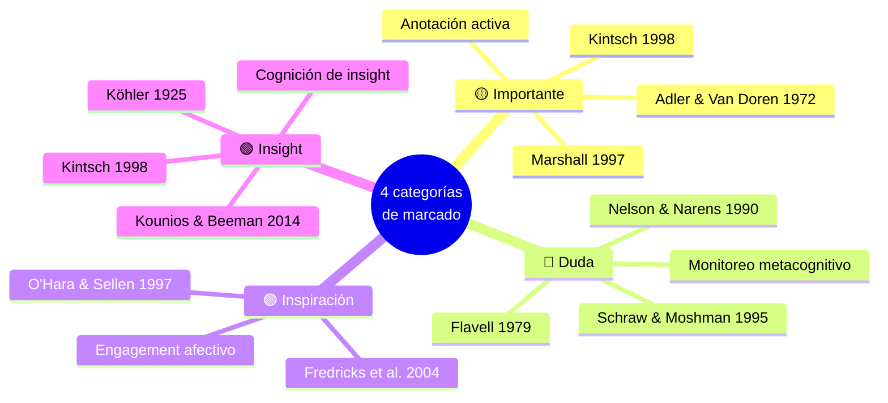

# Marco teórico

## Vista esquemática

## La idea matriz

Las cuatro categorías de marcado del cuaderno digital están ancladas en **cuatro tradiciones teóricas independientes** con literatura clásica desde 1925. Esto blinda al instrumento contra la crítica de que las categorías son arbitrarias o derivadas del producto comercial.

## Cuatro tradiciones que sostienen el sistema

### 1. Teoría de la anotación activa

- **Adler & Van Doren (1972)** — marcar un texto es "conversar con el autor"
- **Marshall (1997)** — la anotación digital tiene doble función: interpretación privada + comunicación social
- **Wolfe & Neuwirth (2001)** — la anotación electrónica es categóricamente distinta del subrayado en papel por captura, persistencia y análisis

Justifica el principio fundacional del cuaderno: **resaltar con código semántico es un acto cognitivo, no decorativo**, y por lo tanto observable como dato.

### 2. Teoría de la metacognición (pieza más potente)

- **Flavell (1979)** — metacognición como "pensar sobre el propio pensar"
- **Nelson & Narens (1990)** — distinción meta-nivel (monitoreo y control) vs objeto-nivel (procesamiento del contenido)
- **Schraw & Moshman (1995)** — conocimiento de cognición vs regulación de cognición
- **Tarchi (2017)** — el monitoreo metacognitivo durante la lectura correlaciona con comprensión profunda

Marcar como "duda" **es** metacognición observable: la docente declara públicamente *"me doy cuenta de que esto no lo entiendo todavía"*. Marcar como "insight" es metacognición de logro: *"me doy cuenta de que esto se conectó con algo"*.

Esta tradición se conecta directamente con la **autonomía y agencia docente** que el International Task Force on Teachers for Education 2030 / UNESCO (2025) identifica como pilar de la integración pedagógica de IA.

### 3. Cognición pedagógica del docente (PCK)

- **Shulman (1986; 1987)** — Pedagogical Content Knowledge: los docentes no procesan el material como estudiantes, lo procesan como diseñadores de experiencias de aprendizaje
- **Razon et al. (2012)** — tipología contemporánea de anotaciones colaborativas (cognitivas, metacognitivas, afectivas, organizacionales) que mapean directamente a las 4 categorías del proyecto
- **Mu & Gilbert (2007)** — patrones de anotación personal con 6 categorías

Lo que distingue al sistema del proyecto de uno de highlights tradicional es que está **diseñado para docentes**, no para estudiantes: las cuatro categorías capturan modalidades de **intervención profesional** sobre material formativo.

### 4. Cognición de insight

- **Köhler (1925)** — el insight como reestructuración súbita de la representación mental del problema (Gestalt)
- **Kintsch (1998)** — modelo Construction-Integration: el insight es el momento de integración exitosa con conocimiento previo
- **Kounios & Beeman (2014)** — el momento "aha!" tiene firma neural distinta del procesamiento analítico

Previene que la categoría Insight se confunda con "me gustó" — está reservada específicamente para **reestructuración cognitiva**.

## Mapeo categoría × constructo

| Categoría | Anclaje teórico principal | Constructo central |
|-----------|---------------------------|---------------------|
| 🟡 Importante | Adler & Van Doren (1972) · Pressley & Afflerbach (1995) · Kintsch (1998) | Selección significativa durante la construcción del modelo situacional |
| 🔵 Duda | Flavell (1979) · Schraw & Moshman (1995) · Nelson & Narens (1990) · Tarchi (2017) | Monitoreo metacognitivo de brecha de comprensión |
| 🟣 Inspiración | Fredricks, Blumenfeld & Paris (2004) · O'Hara & Sellen (1997) | Engagement afectivo-generativo: activación de cognición creativa o conexión personal |
| 🟢 Insight | Köhler (1925) · Kounios & Beeman (2014) · Kintsch (1998) | Reestructuración cognitiva / integración con conocimiento previo |

## Conexiones complementarias y legitimantes

- **Self-Regulated Learning** (Zimmerman 2002, Pintrich 2000) — las 4 categorías son artefactos observables de la fase de performance del SRL
- **Pedagogía crítica latinoamericana** (Freire 1970) — anclaje regional legitimante
- **Teacher Task Force / UNESCO (2025)** — el sistema operacionaliza la metacognición profesional docente como acto observable, en línea con el marco de autonomía y agencia docente

## Cita estratégica para insertar en el formulario ANII

??? tip "Click para ver la cita propuesta"
    *"El sistema de captura propuesto sintetiza la tradición de anotación activa (Adler & Van Doren, 1972; Marshall, 1997), el modelo de monitoreo metacognitivo (Flavell, 1979; Schraw & Moshman, 1995; Nelson & Narens, 1990), la cognición pedagógica del docente (Shulman, 1986, 1987; Razon et al., 2012) y la investigación en cognición de insight (Köhler, 1925; Kounios & Beeman, 2014), operacionalizando cuatro modalidades de intervención pedagógica observables y mutuamente excluyentes en el momento de la marcación."*

## Limitaciones reconocidas del marco

### Modalidades no cubiertas por las 4 categorías

El sistema cubre cognitivo (Importante), metacognitivo (Duda), afectivo-generativo (Inspiración) e integración (Insight). **No cubre** dos modalidades que la literatura considera tipos legítimos:

- **Evaluativa-crítica** (acuerdo/desacuerdo con el contenido — Mu & Gilbert 2007). Posible 5ª: 🔴 "Disenso" o "Cuestionamiento"
- **Aplicativa** (intención de uso en el aula). Está parcialmente cubierta por los mini-retos, pero podría capturarse como categoría adicional: 🟧 "Aplicar"

Estas se mencionan en el manuscrito como **futuras líneas del instrumento** — eso aporta honestidad académica.

### Validación psicométrica pendiente

Las 4 categorías están definidas conceptualmente pero **no han sido validadas empíricamente** (fiabilidad inter-juez ni validez de constructo). El proyecto ANII incorpora la primera evidencia de fiabilidad como **sub-objetivo metodológico declarado**, convirtiendo la debilidad en aporte.

→ Marco original con todas las referencias completas en `contexto_anii_consolidado.md` (sección 3).

---

[:material-arrow-right-circle: Sigue: Metodología](metodologia.md){ .md-button .md-button--primary }
