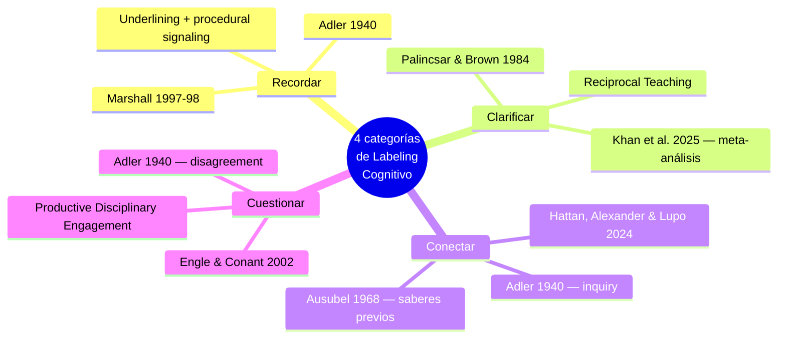
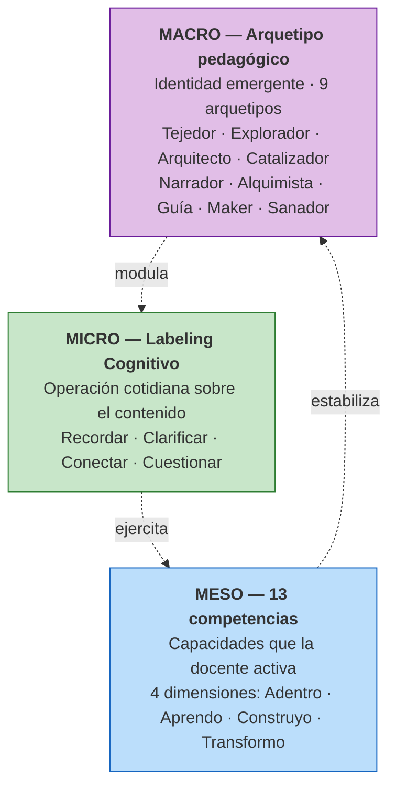

# Marco teórico

## Vista esquemática

## La idea matriz

Las cuatro categorías de Labeling Cognitivo del cuaderno digital se anclan en la tipología fundacional de **Mortimer Adler (1940)** *"How to Mark a Book"*, retomada y refinada por la investigación contemporánea en *annotation theory* y comprensión profunda. La tesis de Adler es directa: marcar un texto con código semántico es un acto cognitivo distinguible, no decorativo, que expresa funciones diferentes según el tipo de marca.

> **El Labeling Cognitivo retoma a Adler en ese punto: marcar es categorizar, y categorizar es pensar.**

Esta fundamentación se complementa con un hallazgo crítico de Dunlosky et al. (2013) en la revisión más citada sobre estrategias de aprendizaje: **el resaltado solo —marcar sin elaborar— tiene utilidad cognitiva baja**. Lo que produce comprensión profunda es la *elaborative interrogation*: convertir el marcado en una pregunta o explicación que obliga a comprometer el conocimiento previo con lo leído.

Por eso el cuaderno digital integra deliberadamente la **nota propia de la docente** sobre cada marca como pieza arquitectónica, no como agregado opcional. La etiqueta sola es una señal pobre; la etiqueta más la nota en lenguaje natural de la docente es una señal rica.

## Las cuatro categorías y su anclaje

### Recordar

**Función cognitiva:** memoria, importancia, retorno deliberado al contenido.

- **Adler (1940)** — *underlining* como acto de selección consciente para retención
- **Marshall (1997, 1998)** — *procedural signaling* en annotation theory
- **Cui et al. (2024)** — los sistemas de annotation con tagging mejoran engagement y comprensión

La docente marca con código Recordar el contenido que considera significativo para retener y volver. Es la categoría más cercana a la noción tradicional de "subrayado activo" pero codificada explícitamente como acto de retención.

### Clarificar

**Función cognitiva:** confusión, falta de comprensión, señal de no entender todavía.

- **Palincsar y Brown (1984)** — *clarifying* como una de las cuatro estrategias clave del *Reciprocal Teaching*
- **Khan et al. (2025)** — meta-análisis reciente con Cohen's d entre 0,42 y 0,47 para efectos de Reciprocal Teaching en comprensión

La docente marca con código Clarificar el contenido donde reconoce una brecha de comprensión que necesita aclaración. A diferencia de la categoría anterior "Duda" en la versión inicial del modelo, Clarificar pone el énfasis en la acción posterior esperada (resolver, aclarar) más que en el estado emocional de duda.

### Conectar

**Función cognitiva:** generatividad, conexión con conocimiento previo, idea propia que el contenido detona.

- **Hattan, Alexander y Lupo (2024)** — meta-revisión en *Review of Educational Research* sobre la activación de saberes previos
- **Ausubel (1968)** — anclaje cognitivo del nuevo conocimiento sobre estructuras previas
- **Adler (1940)** — *inquiry* como conexión productiva
- **Palincsar y Brown (1984)** — *predicting* como anticipación informada por conocimiento previo

La docente marca con código Conectar el contenido que detona una idea propia o establece un puente con su práctica de aula. Es la categoría más generativa: pide elaboración explícita en la nota propia.

### Cuestionar

**Función cognitiva:** disenso, contradicción con la propia experiencia o convicción, reestructuración cognitiva.

- **Engle y Conant (2002)** — *productive disciplinary engagement*: el desacuerdo autorizado dispara reestructuración del esquema mental
- **Adler (1940)** — *disagreement* como acto cognitivo más exigente
- **Ausubel (1968)** — discrepancia entre saber previo y texto como motor de aprendizaje

La docente marca con código Cuestionar el contenido con el que disiente, que contradice su experiencia o su convicción profesional. Esta es la categoría con mayor potencia cognitiva: el desacuerdo formulado abre la posibilidad de reestructurar el esquema.

## Mapeo categoría × constructo

| Categoría | Anclaje teórico principal | Constructo central | Lo que produce la nota propia |
|-----------|---------------------------|---------------------|-------------------------------|
| Recordar | Adler (1940), Marshall (1997) | Selección significativa para retención | Por qué la docente quiere recordar esto |
| Clarificar | Palincsar y Brown (1984) | Reconocimiento de brecha de comprensión | Qué específicamente no entiende todavía |
| Conectar | Hattan, Alexander y Lupo (2024); Ausubel (1968) | Activación de conocimiento previo | Con qué de su práctica lo conecta |
| Cuestionar | Engle y Conant (2002) | Disenso productivo | Qué argumenta en contra y por qué |

## La arquitectura macro-meso-micro

El Labeling Cognitivo es la operación **micro** de un sistema de tres niveles articulados:

**El sistema funciona porque los tres niveles se articulan bidireccionalmente:**

- En sentido **ascendente**, los actos micro de Labeling Cognitivo ejercitan competencias meso, que al acumularse producen el patrón estable que el sistema reconoce como arquetipo macro.
- En sentido **descendente**, el arquetipo identificado modula la personalización del entorno: las preguntas disparadoras, los retos sugeridos y el lenguaje del cuaderno se ajustan al modo predominante de la docente.

!!! note "Para el estudio ANII"
    El proyecto observa la operación **micro** (Labeling Cognitivo) como evidencia granular de proceso. Las dimensiones macro (arquetipos) y meso (competencias) se aplican como caracterización descriptiva de la cohorte mediante el SJT-POV inicial, sin elevarlas a variables predictoras (decisión deliberada para mitigar el conflicto de interés del instrumento).

## Conexiones complementarias

- **Self-Regulated Learning** (Zimmerman, 2002) — las cuatro categorías son artefactos observables de la regulación cognitiva durante la lectura
- **Machine Teaching** (Mosqueira-Rey et al., 2023) — la secuencia "etiqueta humana primero, nota humana segundo, respuesta de IA tercero" sitúa al sistema en régimen de machine teaching, no de IA-led
- **Teacher Task Force / UNESCO (2025)** — el sistema operacionaliza la autonomía y agencia docente frente a la integración de IA: la docente opera, no es operada
- **Pedagogía crítica latinoamericana** (Freire, 1970) — anclaje regional legitimante: la docente como sujeto que dialoga con el material, no como receptor pasivo

## La paradoja cognitiva de la IA, resuelta por arquitectura

Literatura emergente (Frontiers in Education, 2025) advierte sobre una **paradoja cognitiva** en el uso de IA en educación: cuando los aprendices reciben respuestas autogeneradas y las aceptan pasivamente, el engagement crítico se reduce en lugar de aumentar.

El cuaderno digital resuelve esta paradoja por arquitectura, no por buena intención:

1. La docente **etiqueta** con código Labeling Cognitivo primero
2. La docente **escribe su nota propia** segundo
3. La elaboración asistida por IA (señalador) responde **tercero**

La intervención humana precede al feedback de la máquina. La docente opera el sistema, no es operada por él.

## Limitaciones reconocidas

### Validación psicométrica pendiente

Las cuatro categorías están definidas conceptualmente con anclaje en tradiciones consolidadas, pero **no han sido validadas empíricamente** en cohorte docente latinoamericana. El proyecto ANII incorpora primeras evidencias de propiedades observadas como reporte exploratorio, sin pretender validación psicométrica completa con N=80.

### Modalidades no cubiertas

El sistema cubre cuatro funciones cognitivas distinguibles que combinan selección, monitoreo, generación y crítica. No cubre, por diseño:

- **Evaluativa-afectiva** (me gusta / no me gusta): el sistema privilegia funciones cognitivas sobre reactivas
- **Aplicativa** (intención específica de uso en aula): parcialmente cubierta por los mini-retos, no por el código Labeling

Estas limitaciones se mencionan como futuras líneas del instrumento.

---

[:material-arrow-right-circle: Sigue: Metodología](metodologia.md){ .md-button .md-button--primary }
