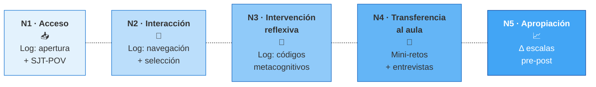

# Pregunta y modelo de niveles

## Pregunta principal de investigación

> ¿Qué tipologías de intervención pedagógica sobre material formativo digital de IA construyen las docentes dominicanas durante un itinerario de 10 semanas, y qué condiciones de uso del cuaderno digital se asocian con cada tipología?

## Sub-preguntas

1. ¿Cómo se asocian las tipologías de intervención observadas con la autoeficacia y la motivación profesional docente, medidas en los momentos pre y post del itinerario?
2. ¿Qué evidencia de transferencia al aula reportan las docentes —vía mini-retos con artefactos, autorreporte estructurado y sub-muestra cualitativa— y cómo se asocia con las tipologías observadas?

## Cuatro objetivos específicos

| # | Objetivo específico | Aborda |
|---|---------------------|--------|
| 1 | Caracterizar las tipologías de intervención pedagógica observadas en docentes dominicanas durante un itinerario formativo digital de diez semanas sobre IA en el aula | Pregunta principal · Niveles 2-3 |
| 2 | Explorar la asociación entre las tipologías de intervención observadas y los cambios pre-post en autoeficacia y motivación profesional docente | Sub-pregunta 1 · Nivel 5 |
| 3 | Caracterizar la evidencia de transferencia al aula reportada por las docentes y su asociación con las tipologías observadas | Sub-pregunta 2 · Nivel 4 |
| 4 | Producir un documento metodológico abierto bajo licencia CC-BY como insumo replicable para la Red LATE y equipos de investigación regional | Transferencia metodológica |

## Modelo de cinco niveles de observación

!!! warning "Atención: descriptivo-organizativo, no causal"
    Los niveles son **lentes analíticas** para diferenciar evidencias heterogéneas, **no fases obligatorias** ni teoría causal del cambio. Una docente puede estar en Nivel 2 sin alcanzar Nivel 3. No se asume progresión lineal.

### Vista esquemática

*Las líneas punteadas indican relación de orden conceptual entre lentes de observación, no progresión causal entre fases. El análisis cuantitativo se ejecuta sobre N2-N3 (proceso) y se asocia bivariadamente con N4-N5 (outcomes).*

### Tabla de niveles

| Nivel | Definición operativa | Indicador(es) | Instrumento | Momento |
|-------|---------------------|---------------|-------------|---------|
| **1. Acceso** | La docente llega al material y completa el onboarding | Apertura del notebook ≥1 sesión; completitud del SJT-POV; primera marca registrada | Log de eventos del cuaderno | Sem 0–1 |
| **2. Interacción** | Acciones sobre el material sin necesariamente intervenirlo reflexivamente | Frecuencia de chapter_opened, page_shared, tiempo activo, n° highlights "Importante" | Log de eventos filtrado por navegación + highlights de selección | Sem 1–10 (continuo) |
| **3. Intervención reflexiva** | La docente marca/comenta/dibuja con códigos semánticos que evidencian procesamiento cognitivo profundo | Frecuencia y diversidad de highlights Duda / Inspiración / Insight; n° y sustantividad de comments; uso del canvas | Log filtrado por categorías metacognitivas + codificación cualitativa de comments y canvas | Sem 1–10 |
| **4. Transferencia a la práctica** | La docente reporta o evidencia uso del contenido en su aula | Mini-retos completados con artefactos (foto, audio, descripción); autorreporte estructurado; narrativa en entrevistas | Mini-retos quincenales + encuesta de aplicación post + entrevistas semiestructuradas (sub-muestra N=18) | Sem 2, 4, 6, 8, 10 + post |
| **5. Apropiación pedagógica** | Integración del dispositivo y su uso en la identidad/práctica profesional; cambio en autoeficacia/motivación; proyección de continuidad | Δ pre-post Tschannen-Moran (autoeficacia IA); Δ Work Tasks Motivation Scale; intención declarada de continuidad; narrativa de transformación | Escalas pre/post + encuesta de continuidad + entrevistas | Pre / Post / Post-4sem |

## Cómo el modelo organiza el análisis

- LCA / clustering corre sobre **N2 + N3** (proceso) → produce tipologías de intervención
- Asociación bivariada entre tipologías y **N4 + N5** (transferencia + apropiación) → responde SP1 y SP2
- N1 funciona como filtro de elegibilidad analítica (sin acceso no hay caso)
- Cada nivel tiene su propio instrumento, lo que resuelve obs. 5 (claridad conceptual)

!!! danger "Crítica del panel: este modelo tiene tensión con el lenguaje no-causal"
    Aunque declaramos "no causal", el orden 1→5 sugiere progresión y el análisis trata el nivel 5 como outcome distal de niveles 2-3. Esa estructura es de facto un modelo de mediación implícito.

    **Mitigación recomendada:** o bien asumir el modelo causal-mediación explícitamente (y discutir su no-identificabilidad con N=80), o bien reescribir el análisis para que tipologías y cambios pre-post se traten como bloques paralelos correlacionados sin ordenamiento causal implícito. Pendiente decisión de Berenice.

## Las cuatro categorías de marcado

| Color | Categoría | Significado pedagógico | Tradición teórica |
|:-----:|-----------|------------------------|-------------------|
| 🟡 | **Importante** | Selección de contenido significativo o saliente para la práctica docente | Anotación activa: Adler & Van Doren (1972), Marshall (1997), Kintsch (1998) |
| 🔵 | **Duda** | Reconocimiento de brecha de comprensión o necesidad de profundización | Monitoreo metacognitivo: Flavell (1979), Nelson & Narens (1990), Schraw & Moshman (1995) |
| 🟣 | **Inspiración** | Engagement afectivo-generativo: el contenido activa idea o conexión propia | Engagement educativo: Fredricks, Blumenfeld & Paris (2004) |
| 🟢 | **Insight** | Momento de integración / reestructuración cognitiva ("aha!") | Cognición de insight: Köhler (1925), Kintsch (1998), Kounios & Beeman (2014) |

→ Marco teórico completo en [Marco teórico](marco-teorico.md).

---

[:material-arrow-right-circle: Sigue: Marco teórico](marco-teorico.md){ .md-button .md-button--primary }
