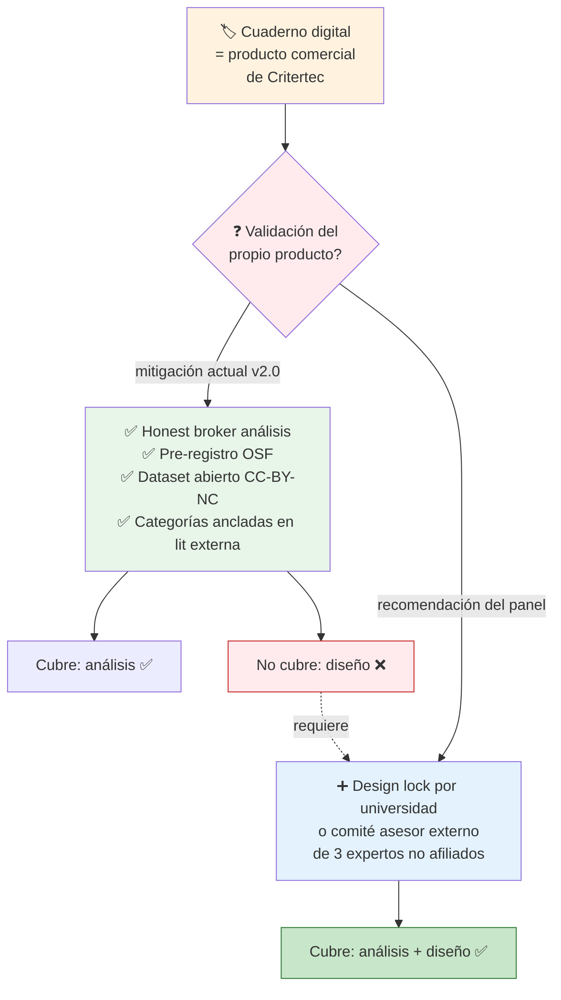

# Riesgos — los 5 críticos del panel

!!! danger "Veredicto: Substantial revision required"
    Si no resolvemos los 5 críticos antes del 11 jun, la propuesta **no es fundable**. Cualquiera de los 5 puede hundirla por separado. Esta página detalla cada uno, su mitigación recomendada, y quién es responsable.

## Mapa rápido

| # | Riesgo | Severidad | Responsable | Plazo |
|---|--------|:---------:|-------------|-------|
| 1 | Conflicto de interés estructural no neutralizado | 🔴 Fatal | Berenice + Sebas | 27 may |
| 2 | LCA con N≈80 produce evidencia inestable | 🔴 Fatal | Berenice | 31 may |
| 3 | Universidad partner sin confirmar | 🔴 Fatal | Sebas + Berenice | 27 may |
| 4 | No hay sección de presupuesto ni Plan de Trabajo operativo | 🔴 Fatal | Sebas | 31 may |
| 5 | Cronograma operativamente inviable | 🟠 Major-fatal | Sebas + Berenice | 31 may |

---

## Flujo de mitigación del CoI estructural

---

## 1. Conflicto de interés estructural en el diseño

??? quote "Lo que dijo el panel adversarial"
    *"El instrumento de medición (cuaderno digital) es producto comercial de la entidad ejecutora (Critertec). Las categorías de codificación están ancladas en literatura, pero los stickers, los nueve arquetipos del SJT-POV, los ítems literales y la identidad narrativa son IP de Critertec (4.8 fila 6). Esto convierte al estudio en 'validación del propio producto en docentes reclutadas vía operación comercial de la misma empresa'. **Honest broker mitiga el análisis, no el diseño.** Un panel exigente preguntará: ¿quién decidió que esas son las cuatro categorías correctas? ¿quién diseñó el itinerario? Esta es la debilidad más dañina: probablemente determina la decisión final."*

### Por qué importa

El honest broker actual cubre **análisis** (la universidad partner ejecuta LCA, asociaciones, kappa). Pero el **diseño** del estudio sigue en manos de Critertec:

- Quién definió las 4 categorías semánticas → Critertec
- Quién diseñó el itinerario formativo → Critertec
- Quién seleccionó los instrumentos → Critertec
- Quién decide qué categoría se incorpora o se descarta → Critertec

Un revisor sofisticado leerá esto como "I+D+i del propio producto".

### Mitigación recomendada por el panel

!!! tip "Re-arquitectura propuesta"
    1. **Trasladar el design lock** del itinerario y la selección final de los códigos semánticos a la **universidad partner** o a un **comité asesor externo** de 3 expertos regionales no afiliados a Critertec
    2. **Firma del design lock** antes del IRB, con acta auditable
    3. **Auditoría externa** de la versión inmutable del cuaderno por la universidad antes del trabajo de campo
    4. **Declaración explícita** de financiamiento y de no-influencia del área comercial de Critertec sobre análisis ni publicación
    5. **Compromiso público** de publicar resultados aun si son desfavorables al cuaderno

### Decisiones que tienen que tomar

- [ ] **Berenice + Sebas:** decidir si se incorpora comité asesor externo o se traslada design lock a universidad partner (27 may)
- [ ] Identificar y contactar a los 3 expertos del comité asesor si esa es la ruta (28 may – 3 jun)
- [ ] **Agregar a 4.7.2** la declaración explícita de no-influencia del área comercial (revisión de redacción)
- [ ] **Agregar a 4.5.4** la lista de funciones de la universidad partner incluyendo design lock

---

## 2. LCA con N≈80 produce evidencia inestable

??? quote "Lo que dijo el panel metodológico"
    *"Las recomendaciones convencionales (Nylund-Gibson & Choi, 2018; Weller et al., 2020) sugieren N≥300 para LCA estable con 3+ clases e indicadores múltiples; con N=80 los errores estándar de las probabilidades de pertenencia serán amplios, BLRT y BIC tendrán bajo poder para discriminar entre k=3 y k=5, y la entropía probablemente sea <0,7. El riesgo es generar 'tipologías' inestables que no se replicarían en otra muestra."*

### Por qué importa

El **Objetivo Específico 1** descansa sobre el LCA: caracterizar tipologías de intervención. Si el LCA no produce solución estable, el OE1 se cae, y con él el manuscrito, el documento metodológico y el dataset citable como "tipologías caracterizadas". Es el corazón del estudio.

Con N final ≈80 y mortalidad del 25-35%:

- Asociaciones bivariadas pre-post detectan solo efectos grandes (d≥0,7)
- LCA con 3-5 clases queda con celdas de 8-15 casos
- Modelos no convergen o convergen mal
- Criterios de bondad (BIC, entropía) son ruidosos

### Mitigación recomendada por el panel

!!! tip "Re-calibración propuesta"
    1. **Desplazar el centro analítico** del LCA exploratorio a una **taxonomía a priori** derivada de la teoría declarada (las 4 categorías + modelo de 5 niveles)
    2. Validar empíricamente con **análisis descriptivo** + **análisis de perfiles latentes simple** (2-3 perfiles máximo)
    3. Reservar LCA solo como **análisis secundario** condicionado a N>100
    4. Reportar **potencia simulada** para las asociaciones bivariadas clave en 4.3.1
    5. **Plan de contingencia con tres tramos** según N final: ≥80 plan original; 60-80 reducir clases; <60 descriptivo puro

### Decisiones que tienen que tomar

- [ ] **Berenice:** decidir si pivotamos a taxonomía a priori + perfiles latentes simples (31 may)
- [ ] Si pivotamos: re-redactar 4.3.1 sección 4 (análisis) (31 may – 3 jun)
- [ ] Si pivotamos: actualizar OE1 en 4.2.2 para que el resultado esperado sea "caracterización descriptiva" en lugar de "tipologías por LCA" (31 may)
- [ ] **Berenice + Steven:** decidir software (Mplus vs poLCA en R) — afecta presupuesto y expertise requerida

---

## 3. Universidad partner sin confirmar (filtro A.2)

??? quote "Lo que dijo el panel de presupuesto y equipo"
    *"Es el filtro A.2 (bloqueante) según notas de cierre #1 y aval IRB sin universidad confirmada es no-go absoluto. Sin nombre + sin convenio firmado, el panel ANII no puede validar capacidad real."*

### Por qué importa

Sin universidad partner:

- **No hay aval IRB** → no hay aprobación ética → no se puede ejecutar
- **No hay honest broker** → no se mitiga el CoI → el estudio se lee como validación comercial
- **No hay coautoría académica** → la solvencia científica de la propuesta se desploma
- **Falla el filtro A.2** → ANII puede no procesar la postulación

### Mitigación recomendada por el panel

!!! tip "Plan A + Plan B"
    **Plan A (preferido):** cerrar universidad partner antes del 27 may con:
    
    - Nombre de la institución
    - Perfil del referente académico (CV)
    - Carta aval institucional firmada
    - Borrador de convenio honest broker
    
    **Plan B (contingencia):** identificar segunda universidad o IRB independiente como respaldo. Opciones a explorar: PUCMM, INTEC, universidad pública dominicana, o IRB regional.

### Decisiones que tienen que tomar

- [ ] **Sebas + Berenice:** confirmar universidad partner antes del 27 may
- [ ] **Berenice:** preparar borrador de convenio honest broker con funciones detalladas
- [ ] **Sebas:** gestionar firma de carta aval (formato + texto + firma)
- [ ] **Sebas + Berenice:** si Plan A no se cierra para el 27 may, activar Plan B inmediatamente

---

## 4. Sin sección de presupuesto ni Plan de Trabajo operativo

??? quote "Lo que dijo el panel adversarial"
    *"La propuesta v2.0 no incluye Sección 5 (presupuesto), las tablas de FTE/honorarios, ni un Gantt operativo. El plan de trabajo (4.4) está marcado como 'pendiente desarrollar' y son cinco renglones agregados. Es un hueco grave para una solicitud competitiva."*

### Por qué importa

USD 50K es un monto ajustado para el alcance prometido. El panel necesita ver **factibilidad financiera y de capacidad humana** antes de discutir mérito. La ausencia de presupuesto detallado se lee como **propuesta inmadura**.

Actividades sin presupuesto detectadas por el panel:

- Salario investigador junior 9 meses (~USD 12.400–18.600)
- Honorarios panel Tschannen-Moran (~USD 1.000–1.500)
- Licencia software LCA (~USD 350–695)
- Entrevistas + transcripción 18 docentes (~USD 2.500–3.500)
- APC manuscrito (~USD 2.000 contingencia)
- Honest broker universitario (billable vs in-kind)
- Storage cloud + backup
- Webinar Red LATE (plataforma)

### Mitigación recomendada por el panel

!!! tip "Lo que hay que desarrollar"
    1. **Sección 5 PRESUPUESTO**: tabla por rubro con topes ANII (personal técnico ≤70%, administración ≤5%, imprevistos ≤5%)
    2. **Tabla equipo × actividad × dedicación**: nombre, rol, FTE %, costo por persona-mes
    3. **Plan de Trabajo (4.4)**: Gantt operativo semanal de 36 semanas con dependencias y entregables verificables
    4. **Identificar contraparte**: aportes in-kind de Critertec, universidad partner, Soy Digital

### Decisiones que tienen que tomar

- [ ] **Sebas:** desarrollar Sección 5 con desglose por rubro (31 may)
- [ ] **Sebas + Agus + Steven:** especificar FTE y dedicación porcentual de cada miembro (31 may)
- [ ] **Sebas:** desarrollar Gantt semanal con responsables y dependencias (3 jun)
- [ ] **Sebas:** decidir y documentar contraparte in-kind de Critertec
- [ ] **Sebas + Berenice:** confirmar contraparte de universidad partner (in-kind vs billable)

---

## 5. Cronograma operativamente inviable

??? quote "Lo que dijo el panel de presupuesto"
    *"M1 octubre 2026 (mes único, 5 actividades críticas paralelas): IRB + reclutamiento N=120 + ajustes curso + entrenamiento codificación + panel adaptación Tschannen-Moran no caben en 30 días. M3-M5 diciembre 2026 - febrero 2027 incluye receso escolar dominicano (~3 semanas: 15 dic - 8 ene aprox); la mortalidad real será mayor al 35% si el itinerario corre en pleno receso. M7-M9 abr-jun 2027: seis entregables en 90 días con datos recién cerrados — realistically 5-6 meses de trabajo concentrado."*

### Por qué importa

Tres cuellos de botella concatenados:

- M1 sobrecargado → IRB demora → todo el cronograma se corre → la prórroga de 3 meses queda comprometida
- M3-M5 atraviesa receso escolar dominicano → mortalidad sube → N final cae bajo 60 → análisis se reduce a descriptivo puro
- M7-M9 con 6 entregables → algún producto no se entrega o se entrega de baja calidad

### Mitigación recomendada por el panel

!!! tip "Reorganización propuesta"
    1. **Adelantar IRB y panel Tschannen-Moran a M0** pre-grant (requiere financiamiento puente o aportes in-kind)
    2. **Calendarizar el itinerario evitando receso escolar**: inicio efectivo enero 2027 (reajustar M2 y M6 en cascada)
    3. **Diferir webinar y reporte policy** a un mes posterior al cierre formal (no son entregables ANII estrictos)
    4. **Priorizar como entregables críticos**: dataset + documento metodológico + reporte ejecutivo
    5. **Reformular el manuscrito** como "en preparación al cierre, depositado como preprint en M+3 post-cierre"
    6. **Agregar pre-registro OSF** como hito explícito en M1 (antes de M2 baseline)

### Decisiones que tienen que tomar

- [ ] **Sebas + Berenice:** decidir si adelantamos IRB y panel a M0 (afecta presupuesto puente)
- [ ] **Sebas:** reajustar 4.4 con calendario que evite receso escolar
- [ ] **Berenice:** redefinir entregables críticos vs diferibles en 4.5.3
- [ ] **Sebas:** agregar hito pre-registro OSF en 4.4
- [ ] **Berenice:** decidir si manuscrito sometido o preprint depositado como compromiso de cierre formal

---

## Major adicionales (deben corregirse pero no son fatales individualmente)

??? warning "Click para ver los Major (10 items)"

    6. **D.II pide "estrategias más efectivas" pero la propuesta dice "asociaciones"** sin defender el pivot. → Agregar párrafo en 4.5.1 reposicionando evidencia de proceso granular como "primer paso necesario que D.II requiere".

    7. **Sub-muestra cualitativa N=18 con lógica circular** ("2 por tipología emergente" presupone conocer tipologías antes de seleccionar). → Reformular como muestreo en dos olas: ola 1 (~8) de máxima variación previo al LCA; ola 2 (~10) confirmatoria post-LCA.

    8. **Adaptación Tschannen-Moran sin actividad/costo/hito.** → Añadir actividad explícita en M0/M1 con responsable, panel de expertos pagados, reporte de propiedades psicométricas.

    9. **Innovation overclaim sin demostrar diferenciación** de learning analytics existente. → Agregar 150-200 palabras en 4.5.1 que revisen literatura específica (xAPI, Caliper, Siemens, Reich) y precisen qué hace el dispositivo que esa literatura no haya hecho.

    10. **Validez de constructo — tipologías circulares dependientes del menú de UI.** → Agregar discusión explícita de validez de constructo en 4.3.1 + análisis de sensibilidad con doble codificación humana de un sub-conjunto.

    11. **N=120 vs N final ≈80 vs <60** inconsistente entre resumen publicable y cuerpo metodológico. → Alinear el rango operativo coherente en 4.10.1, 4.3.1 y 4.6.

    12. **Pre-registro OSF antes de recolección con instrumentos no finalizados.** → Adoptar pre-registro en dos niveles: confirmatorio para escalas pre-post; exploratorio declarado para tipologías con árbol de decisión documentado.

## Mejoras de framing (Minor — pulido del estilo y presentación)

??? info "Click para ver los Minor (~60 items)"

    - **Concordancia de género en resumen español:** "qué los inspira" → "qué las inspira" (4.10.1)
    - **Nomenclatura inconsistente:** estandarizar "categorías semánticas de marcado (a priori, 4)" vs "tipologías de intervención (a posteriori)"
    - **"Universidad partner" sin nombrar a través del documento** — resolver tras confirmación
    - **Notas internas dejadas en el documento** (encabezado "pendiente revisión", "tabla pendiente desarrollar", "Notas de cierre — pendientes operativos") → eliminar antes del envío
    - **Lista de acrónimos faltante** (ANII, OCDE, TALIS, ALC, RD, IA, MINERD, INDOTEL, BID, IRB, LCA, SJT-POV, REDI, RELET, AERA, Red LATE, TTF, UNESCO, CC-BY, OSF, ADR, FTE)
    - **Subir el modelo de cinco niveles** del anexo interno al cuerpo de 4.3.1
    - **Suavizar formulaciones autoelogiosas** ("La novedad metodológica del proyecto reside...", "abre vocabulario y herramientas")
    - **Definir "honest broker académico"** en español en su primera aparición
    - **Eliminar anglicismos** ("research aplicada", "stickers y postits", "plataforma-agnóstica", "insights")

    → Lista completa en [Panel review](../academico/panel-review.md).

---

[:material-arrow-right-circle: Sigue con: Tareas pendientes](tareas.md){ .md-button .md-button--primary }
