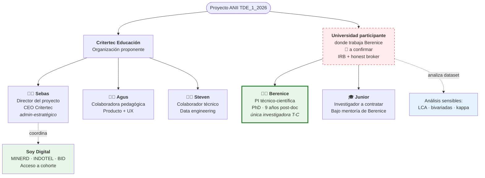

# El equipo y los roles

!!! info "Estructura de roles en este proyecto"
    El proyecto distingue dos niveles bien diferenciados: la **PI técnico-científica** (Berenice, única investigadora con grado doctoral y afiliación universitaria) y el **equipo Critertec** (colaboradores admin, pedagogía y técnicos, sin atribución científica). Esta separación es deliberada: protege la integridad académica del estudio y soluciona la mitigación de conflicto de interés con la universidad participante como honest broker.

## Vista esquemática

## Quién es cada quién

| Nombre | Rol en el proyecto | Vinculación | Página personal |
|--------|---------------------|-------------|-----------------|
| **Berenice Pacheco-Salazar** | Responsable técnico-científica · PI | Universidad participante (PhD afiliada) | [→ Berenice](berenice.md) |
| **Sebastián Moreno Cruz** | Director del proyecto · admin-estratégico | CEO de Critertec Educación | [→ Sebas](sebas.md) |
| **Agustina Bussi** | Colaboradora pedagógica · Producto · UX | Equipo Critertec | [→ Agus](agus.md) |
| **Steven** | Colaborador técnico · Data engineering | Equipo Critertec | [→ Steven](steven.md) |
| **Investigador junior** | Investigador a contratar · Codificación cualitativa + apoyo metodológico | Contratado bajo mentoría de Berenice | [→ Junior](junior.md) |

!!! abstract "Composición técnico-científica del proyecto"
    **Investigadores del proyecto:** Berenice (PI) + Junior a contratar (asistente de investigación bajo su mentoría).

    **Equipo Critertec (colaboradores operativos):** Sebas, Agus y Steven. Aportan dirección estratégica, pedagogía/producto y captura técnica del log respectivamente, pero **no figuran como investigadores técnico-científicos en el formulario ANII**.

## Matriz de responsabilidades

| Bloque | Berenice | Sebas | Agus | Steven | Junior |
|--------|:--------:|:-----:|:----:|:------:|:------:|
| Pregunta de investigación y marco teórico | ★ lead | | | | |
| Diseño metodológico | ★ lead | | | | |
| Aval IRB y ética | ★ lead | ◐ apoyo admin | | | |
| Reclutamiento vía Soy Digital | ◐ apoyo | ★ lead | | | |
| Articulación MINERD / INDOTEL / BID | | ★ lead | | | |
| Curso piloto: contenido pedagógico | ◐ supervisión | | ★ lead | | |
| Curso piloto: UX y producto | | | ★ lead | ◐ apoyo | |
| Versión inmutable del cuaderno (freeze + ADR) | | ◐ apoyo | ◐ apoyo | ★ lead | |
| Captura del log e infraestructura de datos | ◐ supervisión científica | | | ★ lead | ◐ apoyo |
| Codificación cualitativa de comments y entrevistas | ★ supervisión | | ◐ apoyo | | ★ ejecución |
| Análisis cuantitativo (LCA, asociaciones) | ★ lead | | | ◐ apoyo data | ◐ apoyo |
| Entrevistas semiestructuradas | ★ lead | | ◐ apoyo logística | | ◐ apoyo |
| Manuscrito + paper sometido | ★ lead | | ◐ apoyo redacción | | ◐ co-autoría |
| Documento metodológico abierto | ★ lead | ◐ apoyo admin | ◐ apoyo pedagógico | ◐ apoyo técnico | ◐ apoyo |
| Reporte ejecutivo policy | ◐ apoyo | ★ lead | ◐ apoyo | | |
| Webinar Red LATE | ◐ apoyo | ★ lead | ◐ apoyo | | |
| Gobierno de datos y DMP | ★ supervisión | ◐ apoyo admin | | ★ lead técnico | |
| Gestión administrativa ANII (informes, desembolsos) | | ★ lead | | | |
| Presupuesto y cronograma operativo | | ★ lead | | | |

★ = responsable directo · ◐ = apoyo o input

## Decisiones bloqueantes pendientes (antes del 11 jun 2026)

| Decisión | Decisor | Plazo |
|----------|---------|-------|
| Universidad participante confirmada + carta aval firmada | Berenice (lead) + Sebas (admin) | **27 may 2026** |
| Re-arquitectura del conflicto de interés (honest broker scope) | Berenice | **27 may 2026** |
| Re-calibración del plan analítico (LCA → perfiles latentes) | Berenice | **31 may 2026** |
| Adaptación Tschannen-Moran a IA (panel de expertos vs versión general) | Berenice | **27 may 2026** |
| Presupuesto detallado por rubro y FTE por persona | Sebas (con Agus, Steven) | **31 may 2026** |
| Plan de trabajo operativo Gantt semanal | Sebas | **3 jun 2026** |
| Aprobación final de v2.1 para submission | Berenice | **8 jun 2026** |

## Honest broker — separación operativa

Para mitigar el conflicto de interés (el cuaderno digital es producto de Critertec), la **universidad participante donde trabaja Berenice ejecuta los análisis sensibles** sobre el dataset anonimizado que entrega Critertec:

- Latent Class Analysis / perfiles latentes
- Asociaciones bivariadas pre-post
- Cálculo de kappa de Cohen para codificación cualitativa
- Aval del Comité de Ética y supervisión ética continua

Esto significa que **Critertec no toca los análisis estadísticos sensibles**. Eso es deliberado y es lo que protege la integridad académica del estudio.

!!! warning "Aviso del panel de revisión"
    El honest broker actual cubre análisis, pero NO diseño. El panel recomienda **trasladar también el design lock** del itinerario formativo y la selección final de los códigos semánticos a la universidad participante o a un comité asesor externo de 3 expertos regionales. Mirá [Riesgos → CoI](../donde-estamos/riesgos.md) para más detalle. **Decisión pendiente de Berenice.**

## Gobernanza de decisiones

| Tipo de decisión | Quién decide |
|------------------|--------------|
| Científica / metodológica | **Berenice** (única decisora — PI técnico-científica) |
| Operativa / institucional / presupuesto | **Sebas** (Director del proyecto) |
| Pedagógica / producto | Agus (con consulta a Berenice para validación científica) |
| Técnica / infraestructura | Steven (con consulta a Sebas para presupuesto) |
| Cambio de scope o presupuesto | Comité directivo (Berenice + Sebas + referente universidad participante) |

Reuniones quincenales del comité directivo durante la ejecución; semanal durante la fase de remediación pre-cierre.

---

[:material-arrow-right-circle: Empezar por Berenice (PI)](berenice.md){ .md-button .md-button--primary }
