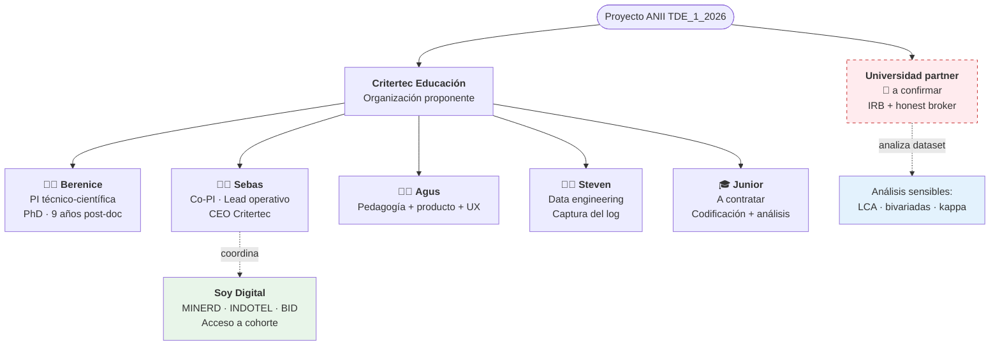

# El equipo y los roles

## Vista esquemática

## Quién es cada quién

| Nombre | Rol en el proyecto | Página personal |
|--------|---------------------|-----------------|
| **Berenice Pacheco-Salazar** | Responsable técnico-científica · PI · PhD con afiliación universitaria | [→ Berenice](berenice.md) |
| **Sebastián Moreno Cruz** | Corresponsable técnico-científico · Co-PI · Lead operativo · CEO Critertec | [→ Sebas](sebas.md) |
| **Agustina Bussi** | Investigadora · Coordinación pedagógica y de producto · UX | [→ Agus](agus.md) |
| **Steven** | Investigador / Consultor · Data engineering · Captura del log observacional | [→ Steven](steven.md) |
| **Investigador junior** | Investigador a contratar · Codificación cualitativa + apoyo metodológico | [→ Junior](junior.md) |

## Matriz de responsabilidades

| Bloque | Berenice | Sebas | Agus | Steven | Junior |
|--------|:--------:|:-----:|:----:|:------:|:------:|
| Pregunta de investigación y marco teórico | ★ lead | ◐ apoyo | | | |
| Diseño metodológico | ★ lead | ◐ apoyo | | | |
| Aval IRB y ética | ★ lead | ◐ apoyo | | | |
| Reclutamiento vía Soy Digital | ◐ apoyo | ★ lead | | | |
| Articulación MINERD / INDOTEL / BID | ◐ apoyo | ★ lead | | | |
| Curso piloto: contenido pedagógico | ◐ apoyo | | ★ lead | | |
| Curso piloto: UX y producto | | | ★ lead | ◐ apoyo | |
| Versión inmutable del cuaderno (freeze + ADR) | | ◐ apoyo | ◐ apoyo | ★ lead | |
| Captura del log e infraestructura de datos | | | | ★ lead | ◐ apoyo |
| Codificación cualitativa de comments y entrevistas | ◐ supervisión | | ◐ apoyo | | ★ lead |
| Análisis cuantitativo (LCA, asociaciones) | ★ lead | | | ◐ apoyo | ◐ apoyo |
| Entrevistas semiestructuradas | ★ lead | | ◐ apoyo | | ◐ apoyo |
| Manuscrito + paper sometido | ★ lead | ◐ apoyo | ◐ apoyo | | ◐ apoyo |
| Documento metodológico abierto | ★ lead | ◐ apoyo | ◐ apoyo | ◐ apoyo | |
| Reporte ejecutivo policy | ◐ apoyo | ★ lead | ◐ apoyo | | |
| Webinar Red LATE | ◐ apoyo | ★ lead | ◐ apoyo | | |
| Gobierno de datos y DMP | ★ lead | ◐ apoyo | | ◐ apoyo | |
| Gestión administrativa ANII (informes, desembolsos) | | ★ lead | | | |

★ = responsable directo · ◐ = apoyo o input

## Decisiones bloqueantes pendientes (antes del 11 jun 2026)

| Decisión | Decisor | Plazo |
|----------|---------|-------|
| Universidad partner final + carta aval | Sebas + Berenice | **27 may 2026** |
| Re-arquitectura del conflicto de interés | Berenice + Sebas | **27 may 2026** |
| Re-calibración del plan analítico (LCA → perfiles latentes) | Berenice | **31 may 2026** |
| Presupuesto detallado por rubro y FTE por persona | Sebas (con Agus, Steven) | **31 may 2026** |
| Plan de trabajo operativo Gantt semanal | Sebas | **3 jun 2026** |
| Aprobación final de v2.1 para submission | Berenice | **8 jun 2026** |

## Honest broker — separación operativa

Para mitigar el conflicto de interés (el cuaderno es producto de Critertec), la **universidad partner ejecuta los análisis sensibles** sobre el dataset anonimizado que entrega Critertec:

- Latent Class Analysis / perfiles latentes
- Asociaciones bivariadas pre-post
- Cálculo de kappa de Cohen para codificación cualitativa
- Aval del Comité de Ética y supervisión ética continua

Esto significa que **Critertec no toca los análisis estadísticos sensibles**. Eso es deliberado y es lo que protege la integridad académica del estudio.

!!! warning "Aviso del panel de revisión"
    El honest broker actual cubre análisis, pero NO diseño. El panel recomienda **trasladar también el design lock** del itinerario formativo y la selección final de los códigos semánticos a la universidad partner o a un comité asesor externo de 3 expertos regionales. Mirá [Riesgos → CoI](../donde-estamos/riesgos.md#1-conflicto-de-interes-estructural-en-el-diseno) para más detalle.

## Gobernanza de decisiones

| Tipo de decisión | Quién decide |
|------------------|--------------|
| Científica / metodológica | Berenice (PI técnico-científica) |
| Operativa / institucional | Sebas (lead operativo) |
| Pedagógica / producto | Agus (con consulta a Berenice) |
| Técnica / infraestructura | Steven (con consulta a Sebas) |
| Cambio de scope o presupuesto | Comité directivo (Berenice + Sebas + referente universidad partner) |

Reuniones quincenales del comité directivo durante la ejecución; semanal durante la fase de remediación pre-cierre.

---

[:material-arrow-right-circle: Tu página personal](berenice.md){ .md-button .md-button--primary }
