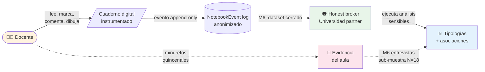

# Cómo funciona

## El método en plain words

### Lo que ve la docente

1. Recibe una invitación a participar a través de Soy Digital (con consentimiento informado bajo Ley 172-13)
2. Hace un test breve de 16 ítems (7 minutos) que la sitúa en uno de nueve arquetipos docentes
3. Empieza un curso de 10 semanas sobre "IA en el aula", organizado como un cuaderno digital con capítulos y bloques
4. Mientras lee, puede:
    - 🟡 **Marcar** texto como importante, duda, inspiración o insight
    - 💬 **Comentar** en texto o voz cualquier bloque
    - 🎨 **Construir** en una mini-pizarra con stickers, postits, dibujos
    - 📸 **Subir mini-retos** cada dos semanas con evidencia de aplicación en su aula
    - ⚙️ **Personalizar** su cuaderno
    - 📤 **Compartir** sus páginas con marcas

### Lo que captura el cuaderno



Cada acción genera un **evento** en un log con marca temporal anonimizada. Eso nos permite reconstruir el recorrido cognitivo de cada docente — cuándo abrió el capítulo, cuánto tardó en su primera marca, qué orden siguió, cuántas veces volvió a un mismo bloque.

```
NotebookEvent {
  type: "highlight_added",
  payload: { phrase, category: "duda", blockId },
  sessionId, userId (anonimizado), timestamp
}
```

### Lo que medimos antes y después

| Momento | Qué medimos |
|---------|-------------|
| **Pre** (semana 0) | Test de arquetipos (SJT-POV) · Escala de autoeficacia docente (Tschannen-Moran adaptada a IA) · Escala de motivación profesional (Work Tasks Motivation Scale) |
| **Durante** (semanas 1-10) | Log de eventos del cuaderno · Mini-retos quincenales (5 retos) |
| **Post** (semana 11) | Las dos escalas otra vez · Encuesta de experiencia · Entrevista cualitativa (sub-muestra N=18) |

### Lo que producimos

Cuatro tipos de output, cada uno para una audiencia distinta:

=== "Académico"

    - **Manuscrito sometido** a revista indexada (Computers & Education, Teaching and Teacher Education o similar)
    - **Dataset anonimizado** depositado en repositorio REDI / Fundación Ceibal con DOI citable
    - **Presentación** en conferencia regional 2027 (AERA-LACE o RELET)

=== "Metodológico"

    - **Documento metodológico abierto** bajo CC-BY: definiciones operativas, plan de análisis, plantillas de instrumentos, modelo de cinco niveles
    - **Protocolo pre-registrado** en Open Science Framework antes de empezar a recoger datos

=== "Política"

    - **Reporte ejecutivo** dirigido a MINERD, INDOTEL, BID-RD, Fundación Ceibal con implicaciones aplicadas
    - **Webinar Red LATE** abierto a la región

=== "Capacidades"

    - **Mentoría académica** a un investigador junior incorporado al equipo
    - **Antecedente formal de colaboración** Critertec ↔ universidad partner para futuras convocatorias

## El modelo de cinco niveles

Para no confundir "abrió el cuaderno" con "transformó su práctica", organizamos la observación en cinco niveles:

| Nivel | Qué observamos | Cómo |
|-------|----------------|------|
| 1. Acceso | Llega al material, completa onboarding | Log: apertura ≥1 sesión |
| 2. Interacción | Hace acciones sobre el material | Log: navegación, marcas de selección |
| 3. Intervención reflexiva | Marca/comenta con códigos metacognitivos | Log: dudas, inspiraciones, insights, comments sustantivos |
| 4. Transferencia al aula | Reporta uso en su aula | Mini-retos con artefactos + entrevistas |
| 5. Apropiación pedagógica | Cambia autoeficacia/motivación | Δ escalas pre-post + intención de continuidad + narrativa |

!!! warning "Atención: este modelo no es causal"
    Los niveles son lentes analíticas, no fases obligatorias. Una docente puede estar en Nivel 2 sin alcanzar el 3. No asumimos progresión lineal. Esto es importante: protege contra el sesgo de leer "interacción digital" como equivalente a "transformación pedagógica".

## El análisis (versión simple)

1. **Sacar tipologías** del comportamiento observado durante las 10 semanas — clustering exploratorio
2. **Relacionar tipologías con cambio pre-post** en autoeficacia y motivación — asociaciones bivariadas
3. **Triangular con la voz cualitativa** de las 18 entrevistas — codificación temática inductiva
4. **Cruzar todo en una matriz de convergencia** que muestre dónde el dato cuanti y la narrativa cuali apuntan a lo mismo

??? info "Versión técnica del análisis"
    - **Latent Class Analysis** sobre indicadores del log para extraer 3-5 clases máximo (declarado como exploratorio, no confirmatorio)
    - **Asociaciones bivariadas** entre clase latente y Δ pre-post en Tschannen-Moran y Work Tasks Motivation Scale
    - **Estadísticos descriptivos** del SJT-POV de arquetipos como caracterización de cohorte (no como predictor)
    - **Codificación temática inductiva** con doble codificación independiente y kappa de Cohen sobre comments y transcripciones de entrevistas
    - **Pre-registro** del protocolo en Open Science Framework antes de la recolección

    El detalle completo en [Profundización académica → Metodología](../academico/metodologia.md).

---

[:material-arrow-right-circle: Sigue con: Línea de tiempo](linea-de-tiempo.md){ .md-button .md-button--primary }
