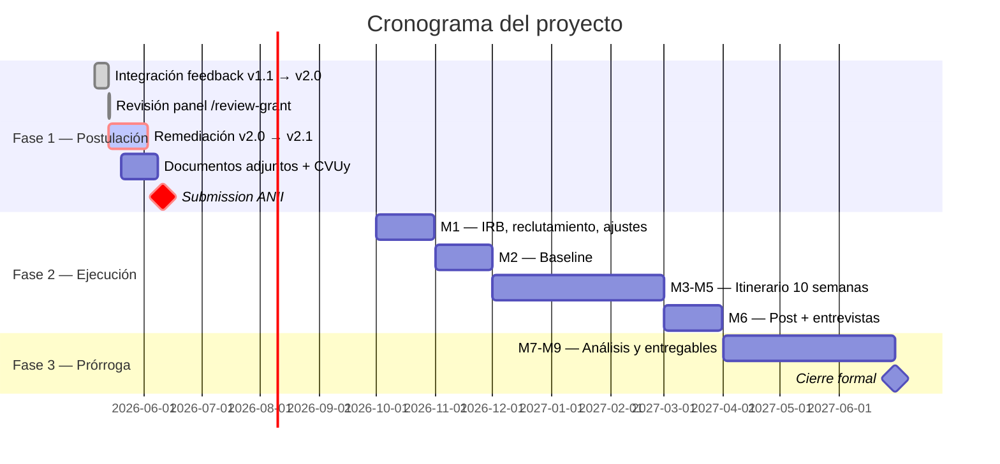

# Línea de tiempo

## Tres fases, dos cierres

## Fechas críticas

!!! danger "Cierre de postulación"
    **11 de junio de 2026, 14:00 GMT-3**

    Después de esta fecha el formulario online de ANII no acepta cambios.

!!! warning "Hitos bloqueantes antes del cierre"
    - Confirmación de universidad partner y carta aval firmada
    - Carta de respaldo institucional MINERD
    - CVUy completo de cada miembro del equipo cargado al formulario
    - Convenio honest broker (borrador anexado si no se firma)
    - Sección 5 PRESUPUESTO desarrollada en el formulario ANII

## Estado actual

| Fase | Inicio | Cierre | Estado |
|------|--------|--------|--------|
| Diagnóstico v1.1 y feedback | 6 may 2026 | 13 may 2026 | ✅ Cerrado |
| Reescritura v2.0 | 13 may 2026 | 13 may 2026 | ✅ Cerrado |
| Revisión panel pre-submission | 13 may 2026 | 13 may 2026 | ✅ Cerrado |
| **Remediación v2.0 → v2.1** | **13 may 2026** | **3 jun 2026** | **🔴 En curso** |
| Documentos adjuntos + CVUy | 20 may 2026 | 8 jun 2026 | ⏳ Pendiente |
| Revisión externa final | 3 jun 2026 | 10 jun 2026 | ⏳ Pendiente |
| Submission ANII | 11 jun 2026 | 11 jun 2026 | ⏳ Pendiente |

## Calendario de ejecución (si se aprueba)

| Mes | Hito principal | Riesgo principal |
|-----|----------------|------------------|
| **M1** oct 2026 | Aval IRB + reclutamiento N=120 + ajustes curso piloto + entrenamiento de codificadores | Sobrecarga de actividades en 30 días — actualmente flaggeado por panel review |
| **M2** nov 2026 | Aplicación baseline (SJT-POV, escalas pre, primera sesión del curso) | Demora IRB en M1 cae M2 |
| **M3-M5** dic 2026 – feb 2027 | Itinerario formativo de 10 semanas con captura continua del log y mini-retos quincenales | Receso escolar dominicano en dic-ene eleva mortalidad |
| **M6** mar 2027 | Aplicación post + entrevistas semiestructuradas + cierre de datos | Disponibilidad de docentes para entrevista limitada |
| **M7-M9** abr – jun 2027 (prórroga) | Análisis cuanti + cuali + manuscrito + documento metodológico + reporte ejecutivo + webinar | 6 entregables en 90 días — sobrecarga reconocida |

??? warning "Tensiones en el cronograma flaggeadas por el panel de revisión"
    - M1 carga 5 actividades simultáneas; el panel recomienda adelantar IRB y panel Tschannen-Moran a M0 pre-grant
    - M3-M5 atraviesa receso escolar dominicano (15 dic – 8 ene aprox); calendarizar el itinerario evitando ese período
    - M7-M9 carga 6 entregables que requieren 5-6 meses de trabajo real; diferir webinar y reporte policy a post-cierre formal
    - Manuscrito sometido en M9 implica análisis cerrado en M7, lo cual choca con que el dataset cierra en M6

    Detalle completo en [Panel review → Cronograma](../academico/panel-review.md).

## Quién decide qué, cuándo

| Decisión | Quién decide | Cuándo |
|----------|--------------|--------|
| Universidad partner final | Sebas + Berenice | Antes del 27 may 2026 |
| Re-arquitectura del CoI (¿comité asesor externo?) | Berenice + Sebas | Antes del 27 may 2026 |
| Re-calibración LCA → perfiles latentes simples | Berenice | Antes del 31 may 2026 |
| Presupuesto detallado y FTE por persona | Sebas (con Agus y Steven) | Antes del 31 may 2026 |
| Aprobación de v2.1 para envío | Berenice (lead científico) | Antes del 8 jun 2026 |
| Submission final | Sebas (corresponsable técnico-científico) | 11 jun 2026 |

---

[:material-arrow-right-circle: Sigue con: El equipo y los roles](../el-equipo/roles.md){ .md-button .md-button--primary }
