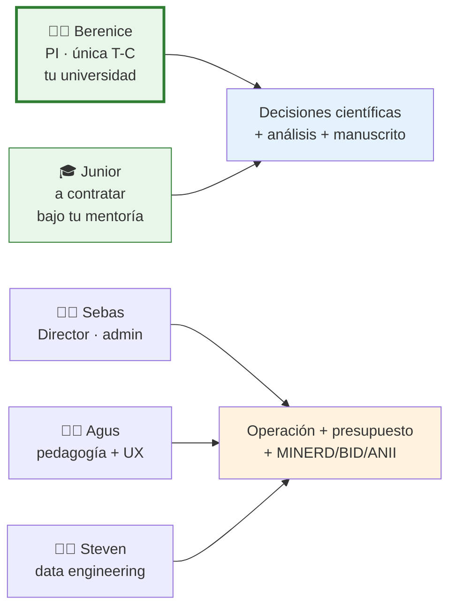

# Paso 1 · El proyecto en 5 minutos

  
Paso 1 de 6 · El proyecto en 5 minutos

  

## Qué se está postulando

Un proyecto de investigación educativa que se postula a la convocatoria **ANII TDE_1_2026 / Fundación Ceibal**, línea **D.II** (metodologías de difusión y acceso). El proyecto se llama:

!!! abstract "Título"
    **Tipologías de intervención pedagógica de docentes dominicanas sobre material formativo digital de inteligencia artificial: un estudio observacional con cuaderno digital instrumentado.**

En una línea: caracterizamos cómo las docentes intervienen efectivamente sobre material formativo digital de IA, usando un cuaderno digital que captura las marcas semánticas, las notas y los comentarios que hacen sobre el material, durante un itinerario formativo de 10 semanas.

## Por qué importa

Hay una **brecha persistente en América Latina y el Caribe** entre certificación formal docente y apropiación efectiva en el aula del uso pedagógico de IA. Las evaluaciones regionales (OCDE-TALIS 2024, Fundación Ceibal 2026) confirman la brecha, pero la evidencia disponible se basa principalmente en **autorreporte declarativo** —encuestas y escalas de satisfacción—. No hay evidencia granular sobre **cómo las docentes intervienen efectivamente** sobre el material que se les ofrece.

Este proyecto produce esa evidencia mediante un dispositivo de captura observacional: el cuaderno digital instrumentado. Las marcas semánticas, comentarios y construcciones de las docentes se registran en un log granular que permite reconstruir el recorrido cognitivo de cada docente sobre el material.

## Por qué República Dominicana

RD presenta una configuración reveladora: **alta certificación formal docente** (88-95% según nivel, datos SICA 2020) que coexiste con **baja madurez** en las dimensiones de capacidad pedagógica para tecnología (2,29 sobre 4), equidad (2,13) y aprendizaje a lo largo de la vida (2,27) del diagnóstico Ceibal 2026. Esa brecha entre cobertura formal y apropiación pedagógica hace de RD un **caso adecuado** para investigar qué condiciones de acceso e intervención sobre material formativo digital se asocian con tipologías diferenciales de uso pedagógico de IA.

Además, Critertec tiene operación activa en RD a través del programa nacional **Soy Digital** (MINERD + INDOTEL + BID, meta de 100.000 personas capacitadas 2025-2026), lo cual da **acceso directo, con consentimiento previo, a una cohorte estratificable** de docentes dominicanas activas.

## Cuándo

| Hito | Fecha |
|------|-------|
| **Cierre de postulación ANII** | 11 jun 2026 · 14:00 GMT-3 |
| Anuncio de resultados | ~ago/sept 2026 (estimado) |
| **M1 — Inicio de ejecución** | oct 2026 |
| M2 — Baseline | nov 2026 |
| M3-M5 — Itinerario formativo 10 semanas | dic 2026 – feb 2027 |
| M6 — Post + entrevistas | mar 2027 |
| M7-M9 — Análisis + manuscrito + entregables (prórroga) | abr – jun 2027 |
| Cierre formal del proyecto | jun 2027 |

**Duración total:** 6 meses de ejecución + 3 de prórroga.

## Quién está detrás

- **Vos sos la única investigadora T-C** del proyecto, con tu universidad como organización participante (aval IRB + honest broker)
- **El junior a contratar** se incorpora bajo tu mentoría como investigador asistente
- **Sebas, Agus y Steven** son **colaboradores operativos de Critertec**, no investigadores; aportan dirección admin-estratégica, pedagogía/producto y captura técnica del log

Esta separación es deliberada: refuerza la mitigación del conflicto de interés con la universidad participante actuando como honest broker académico.

## Cuánto

Presupuesto total **USD 50.000** (techo de la convocatoria línea D.II), con topes ANII:

- Personal técnico ≤ 70% (USD 35.000)
- Administración ≤ 5% (USD 2.500)
- Imprevistos ≤ 5% (USD 2.500)

El desglose detallado por rubro lo desarrolla Sebas con tu validación. Pendiente para 31 may.

## Qué entregamos

1. **Manuscrito** sometido a revista indexada (no se compromete publicación; los tiempos editoriales escapan)
2. **Dataset anonimizado** con DOI citable bajo CC-BY-NC en repositorio REDI / Fundación Ceibal
3. **Documento metodológico abierto** bajo CC-BY (protocolo replicable para Red LATE)
4. **Reporte ejecutivo** para MINERD, INDOTEL, BID-RD, Fundación Ceibal
5. **Webinar** coorganizado con Red LATE
6. **Investigador junior incorporado** al equipo como fortalecimiento de capacidades

---

[← Volver al inicio](index.md){ .wizard-prev }
[Paso 2 · Estado actual →](2-estado-actual.md){ .wizard-next }

