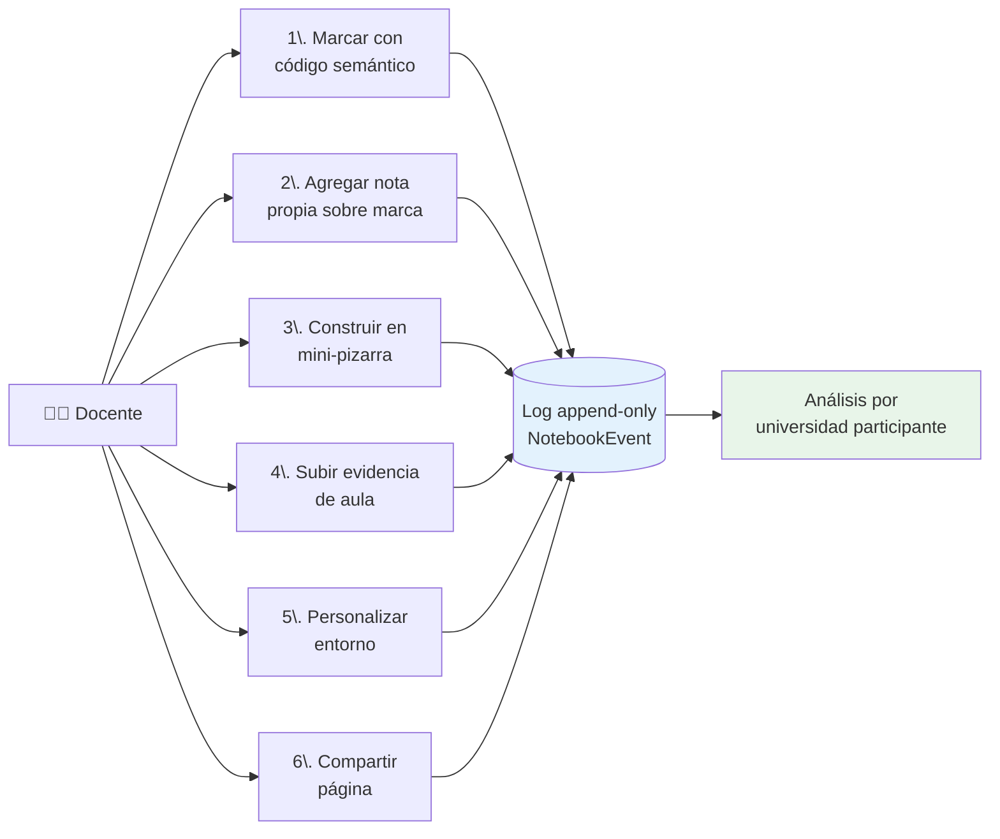

# Paso 4 · La propuesta de investigación

  
Paso 4 de 6 · La propuesta condensada

  

!!! info "Para profundizar"
    Esta página resume la propuesta en lo esencial. Si querés el texto completo de las 15 textareas + 3 tablas que se cargan al formulario ANII, está en [Tablero → Checklist formulario ANII](../tablero/checklist-anii.md) y en el archivo `propuesta_v2_consolidada.md` del repo.

## Pregunta de investigación

!!! abstract "Pregunta principal"
    ¿Qué tipologías de intervención pedagógica construyen las docentes dominicanas sobre material formativo digital de inteligencia artificial durante un itinerario formativo de diez semanas?

**Sub-pregunta 1:** ¿Cómo se asocian esas tipologías con cambios pre-post en autoeficacia y motivación profesional docente?

**Sub-pregunta 2:** ¿Cómo se asocian esas tipologías con la evidencia de transferencia al aula reportada por las propias docentes?

!!! note "Sobre la pregunta"
    Versión refinada en respuesta a tu observación #1 (la pregunta v1.1 mezclaba 4 objetos). La pregunta principal tiene **un único objeto** —tipologías de intervención— y las sub-preguntas abordan los otros constructos (autoeficacia, motivación, transferencia). Carácter exploratorio explícito.

## Objetivos específicos (4 OE)

| # | Objetivo | Resultado esperado |
|---|----------|---------------------|
| **OE1** | Caracterizar las tipologías de intervención pedagógica observadas | Tipologías + estadísticos descriptivos + matriz de convergencia cuanti-cuali |
| **OE2** | Explorar la asociación entre tipologías y cambios pre-post en autoeficacia y motivación | Tabla de asociaciones bivariadas + reporte de patrones diferenciales |
| **OE3** | Caracterizar la evidencia de transferencia al aula reportada por las docentes | Sistematización de mini-retos + codificación temática de evidencia + tabla de co-ocurrencia |
| **OE4** | Producir un documento metodológico abierto bajo CC-BY como insumo replicable | Documento + dataset CC-BY-NC + protocolo pre-registrado en OSF |

## Diseño metodológico (versión v2.0 actual)

**Diseño:** mixto convergente longitudinal corto, 12 semanas (1 baseline + 10 itinerario + 1 cierre), exploratorio.

**Muestra:** N=120 docentes dominicanas activas, reclutadas vía sub-cohorte docente de **Soy Digital** (consentimiento bajo Ley 172-13 RD) + canales MINERD. Estratificación por nivel educativo (inicial, primaria, secundaria) y por zona (urbano-rural). Sobre-reclutamiento del 20% → N final estimado ≈ 80. Sub-muestra cualitativa N=18 para entrevistas semiestructuradas al cierre.

**Triangulación de tres fuentes evidenciales alineadas al modelo de 5 niveles:**

| Nivel del modelo | Instrumento | Momento |
|-------------------|-------------|---------|
| **N1 · Acceso** | Log de eventos del cuaderno (cuándo, qué bloques) | Continuo, sem 1-10 |
| **N2 · Interacción** | Log de eventos (recorrido y permanencia) | Continuo, sem 1-10 |
| **N3 · Intervención reflexiva** | Marcas con código + notas + comments + mini-pizarra | Continuo, sem 1-10 |
| **N4 · Transferencia al aula** | Mini-retos quincenales (foto, audio, descripción) + entrevistas | Quincenal + post |
| **N5 · Apropiación** | Tschannen-Moran (adaptada IA) + Work Tasks Motivation | Pre + post |

**Caracterización descriptiva inicial:** SJT-POV de arquetipos (16 ítems, 4 escenarios) aplicado en baseline. **No como variable predictora** (respuesta a tu observación #4).

**Análisis cuantitativo:** Latent Class Analysis con 3-5 clases máximo, asociaciones bivariadas pre-post, estadísticos descriptivos del SJT.

!!! warning "Pendiente re-calibrar"
    En el [Paso 3](3-lo-critico.md) viste que esta sección depende de tu decisión sobre **LCA vs perfiles latentes simples** (deadline 31 may). Si pivotamos, hay que re-redactar este párrafo y ajustar OE1.

**Análisis cualitativo:** codificación temática inductiva con doble codificación independiente (vos + junior) y kappa de Cohen. **Pre-registro del protocolo en Open Science Framework antes de la recolección.**

## El cuaderno como dispositivo (la pieza innovadora)

El proyecto introduce el **cuaderno digital instrumentado** como dispositivo de captura observacional. **No es una plataforma pedagógica genérica**: es un entorno donde cada acción de la docente sobre el material genera un evento en un log append-only, recuperable y codificado.

**Seis acciones primarias capturadas:**

**Las 4 categorías de Labeling Cognitivo** (versión actualizada en el último commit, ancladas en literatura externa):

| Categoría | Anclaje teórico |
|-----------|-----------------|
| **Recordar** (selección de contenido significativo) | Adler 1940 · Marshall 1997 |
| **Clarificar** (reconocimiento de brecha de comprensión) | Palincsar & Brown 1984 |
| **Conectar** (generatividad, vínculo con conocimiento previo) | Hattan, Alexander & Lupo 2024 · Ausubel 1968 |
| **Cuestionar** (disenso productivo que dispara reestructuración) | Engle & Conant 2002 · Khan et al. 2025 |

!!! tip "Decisión teórica clave"
    Las 4 categorías ahora están ancladas en tradiciones independientes a Critertec (annotation theory + reciprocal teaching). Esto responde a tu observación #6 (definición operativa) y al panel review que pedía bajarle protagonismo al framework Criter para mitigar la percepción de sesgo.

**Régimen de machine teaching:** la docente marca primero, agrega su nota propia segundo, y cualquier elaboración asistida por IA responde tercero. Esto mitiga la paradoja cognitiva de IA en educación (la docente que acepta respuestas autogeneradas reduce su engagement crítico — Frontiers in Education 2025).

## Entregables comprometidos

1. **Manuscrito sometido** a revista indexada de educación o tecnología educativa antes del cierre de la prórroga (compromiso de sometimiento, no de publicación — respuesta a tu observación #10)
2. **Dataset anonimizado** de eventos del log + autoinformes pre-post, en repositorio REDI / Fundación Ceibal con DOI bajo licencia CC-BY-NC
3. **Documento metodológico abierto** bajo CC-BY con definición operativa de las 4 categorías, modelo de 5 niveles, plan de análisis, plantillas de instrumentos
4. **Reporte ejecutivo** para MINERD, INDOTEL, BID-RD, Fundación Ceibal con implicaciones aplicadas
5. **Webinar Red LATE** abierto coorganizado con audiencia estimada de 150 participantes
6. **Investigador junior** incorporado al equipo como fortalecimiento de capacidades locales

## Para profundizar

- 📖 [Profundización académica · Propuesta completa](../academico/propuesta-completa.md)
- 🧠 [Marco conceptual Criter (background del cuaderno)](../academico/marco-conceptual-criter.md)
- 📚 [Marco teórico (4 categorías de Labeling Cognitivo)](../academico/marco-teorico.md)
- 🔬 [Metodología completa](../academico/metodologia.md)
- ❓ [Pregunta y modelo de 5 niveles](../academico/pregunta-y-modelo.md)

---

[← Paso 3 · Lo crítico de ti](3-lo-critico.md){ .wizard-prev }
[Paso 5 · Tus 17 observaciones →](5-respuestas-feedback.md){ .wizard-next }

